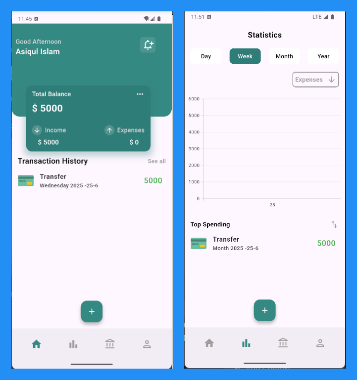

# Finance App

A modern, cross-platform finance management app built with Flutter. Easily track your expenses, visualize your spending, and manage your finances on Android, iOS, Web, Windows, macOS, and Linux.


*Replace `your_screenshot.png` with your actual image file in the `images/` folder.*

## Features
- Add, edit, and delete transactions
- Categorize expenses (e.g., Food, Education, Transportation)
- Visualize spending with charts and statistics
- Multi-platform support (Android, iOS, Web, Desktop)
- Beautiful and intuitive UI

## Getting Started

### Prerequisites
- [Flutter SDK](https://flutter.dev/docs/get-started/install)
- Dart
- An IDE like VS Code or Android Studio

### Installation
1. Clone the repository:
   ```sh
   git clone <repository-url>
   cd finance_app
   ```
2. Get dependencies:
   ```sh
   flutter pub get
   ```
3. Run the app:
   ```sh
   flutter run
   ```

## Project Structure
- `lib/` - Main application code
- `lib/screens/` - App screens (Home, Add, Statistics, etc.)
- `lib/widgets/` - Reusable widgets (charts, navigation bar, etc.)
- `lib/data/` - Data models and utility files
- `images/` - App images and icons

## Contributing
Pull requests are welcome! For major changes, please open an issue first to discuss what you would like to change.

## License
[MIT](LICENSE)

---
*This README includes a placeholder for a project screenshot. Add your image to the `images/` folder and update the path as needed.*
